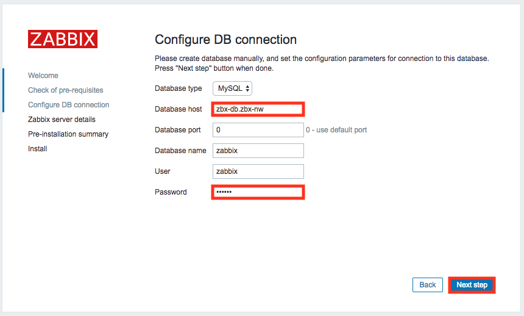
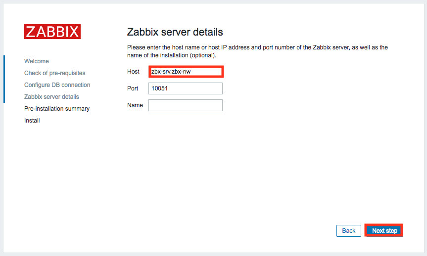

# zbx-container

Zabbixのコンテナを作成して動作させるためのPlaybookです。　

# 出来上がるコンテナ

| コンテナ名 |          説明         |
|------------|-----------------------|
| zbx-srv    | Zabbix Serverコンテナ |
| zbx-web    | Zabbix Webコンテナ    |
| zbx-db     | ZabbixのDBコンテナ    |

# 出来上がりイメージ


`zbx-nw` を作成して必要なコンテナ(プロセス)をNWに紐づけています。

# 必要要件

* ansible
* docker
* python-docker-py

# 使い方

## 必要パッケージインストール(e.g. Centos7)

```shell-session
[root@localhost ~]# yum -y install ansible docker git python-docker-py
```

## docker起動

```shell-session
[root@localhost ~]# systemctl start docker
[root@localhost ~]# systemctl enable docker
```

## リポジトリクローン

```
[root@localhost ~]# git clone https://github.com/sky-joker/zbx-container.git
```

## 実行

```shell-session
[root@localhost ~]# cd zbx-container/
[root@localhost zbx-container]# ansible-playbook installer.yml -i inventory
```

# セットアップ

## Zabbix Webのセットアップ

Zabbixのコンテナをデプロイしたホストへアクセスします。

|              URL              |
|-------------------------------|
| `http://DokerホストIP/zabbix` |

## DB設定

`Configure DB connection` では以下のように設定した後に `Next step` をクリックします。

|      項目     |                  パラメーター                 |
|---------------|-----------------------------------------------|
| Database host | zbx-db.zbx-nw                                 |
| Password      | inventoryで設定したパスワード(default:zabbix) |



## Zabbix Server設定

`Zabbix server details` では以下のように設定して `Next step` をクリックします。

| 項目 |  パラメーター  |
|------|----------------|
| Host | zbx-srv.zbx-nw |



これで使えるようになります :)
